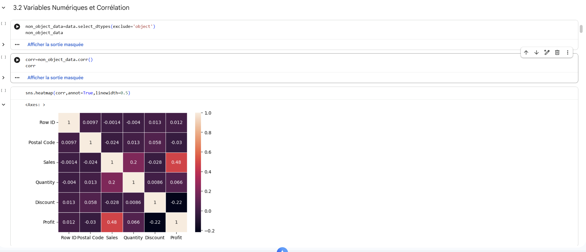
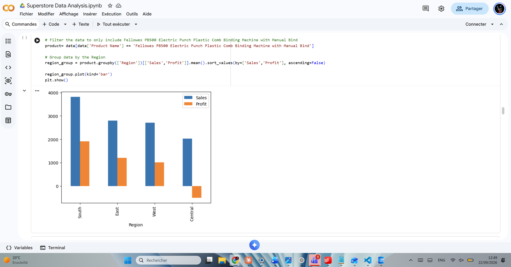

# 📊 Retail Exploratory Data Analysis & Financial Performance (Python)


> Étude exploratoire approfondie (EDA), audit de la qualité de données, analyse de corrélation économétrique et segmentation de rentabilité sur le jeu de données transactionnel Superstore (9 994 transactions).

---

## 📌 Sommaire
1. [Présentation du projet & Contexte métier](#1-présentation-du-projet--contexte-métier)
2. [Problématique analytique & Objectifs](#2-problématique-analytique--objectifs)
3. [Description du dataset & Granularité](#3-description-du-dataset--granularité)
4. [Nettoyage & Préparation des données (Data Cleaning)](#4-nettoyage--préparation-des-données-data-cleaning)
5. [Méthodologie d'Analyse Exploratoire (EDA)](#5-méthodologie-danalyse-exploratoire-eda)
6. [Résultats statistiques & Enseignements métier](#6-résultats-statistiques--enseignements-métier)
7. [Recommandations stratégiques](#7-recommandations-stratégiques)
8. [Limites de l'étude](#8-limites-de-létude)
9. [Compétences techniques et analytiques démontrées](#9-compétences-techniques-et-analytiques-démontrées)
10. [Ce que j'ai appris sur ce projet](#10-ce-que-jai-appris-sur-ce-projet)

---

## 1. Présentation du projet & Contexte métier

- **Domaine :** Distribution omnicanale / Commerce de détail B2B & B2C (Mobilier, Fournitures de bureau, Matériel technologique).
- **Enjeu :** Une grande chaîne de distribution constate que la hausse de son chiffre d'affaires brut ne se traduit pas proportionnellement dans son résultat net d'exploitation. L'entreprise souhaite comprendre l'origine de ses pertes et quantifier l'impact de ses politiques commerciales (notamment les remises) sur la rentabilité réelle.
- **Rôle :** Data Analyst en charge de l'ingestion, de l'exploration statistique, de la détection d'anomalies financières et de la restitution de recommandations chiffrées à l'aide de l'écosystème Python (Pandas, NumPy, Matplotlib, Seaborn).

---

## 2. Problématique analytique & Objectifs

L'analyse répond à trois questions critiques :
1. **L'impact des promotions :** Les remises accordées aux clients stimulent-elles réellement les marges ou détruisent-elles la rentabilité ?
2. **La concentration du chiffre d'affaires et de la marge :** Quels sont les produits qui tirent l'activité financière vers le haut, et les produits phares en vente sont-ils également les plus profitables ?
3. **La distribution des transactions :** Comment se structure le panier moyen et quelles sont les disparités de marge selon les segments de clients et les territoires ?

---

## 3. Description du dataset & Granularité

Le jeu de données comprend **9 994 lignes** et **21 colonnes**, couvrant l'historique complet des commandes de l'entreprise sur le marché nord-américain :

| Variable | Type Python | Description métier |
| :--- | :--- | :--- |
| `Row ID` | `int64` | Identifiant technique unique de la ligne de transaction. |
| `Order ID` | `object` (string) | Identifiant unique de la commande (pouvant regrouper plusieurs articles). |
| `Order Date` / `Ship Date` | `object` ➔ `datetime64` | Dates de passage de commande et d'expédition logistique. |
| `Ship Mode` | `object` (catégorie) | Mode d'expédition (Standard Class, Second Class, First Class, Same Day). |
| `Customer ID` / `Customer Name` | `object` | Identifiant et nom complet de l'acheteur (793 clients uniques). |
| `Segment` | `object` | Segment de marché (Consumer, Corporate, Home Office). |
| `City` / `State` / `Region` | `object` | Localisation géographique (531 villes, 49 États, 4 grandes régions). |
| `Postal Code` | `int64` ➔ `object` | Code postal du lieu de livraison. |
| `Product ID` / `Product Name` | `object` | Identifiant article (1 862 références) et libellé complet du catalogue. |
| `Category` / `Sub-Category` | `object` | Hiérarchie catalogue (3 catégories, 17 sous-catégories). |
| `Sales` | `float64` | Chiffre d'affaires brut généré par la ligne d'article (en USD). |
| `Quantity` | `int64` | Nombre d'unités commandées (de 1 à 14). |
| `Discount` | `float64` | Taux de remise appliqué (exprimé de 0.00 à 0.80, soit 0% à 80%). |
| `Profit` | `float64` | Résultat d'exploitation net généré par la ligne (positif ou négatif). |

---

## 4. Nettoyage & Préparation des données (Data Cleaning)

Avant de procéder à l'analyse exploratoire, un protocole rigoureux d'audit et de nettoyage a été exécuté sous Pandas :

```python
import pandas as pd
import numpy as np

# 1. Chargement avec gestion de l'encodage
data = pd.read_csv('Superstore.csv', encoding='unicode_escape')

# 2. Vérification des valeurs manquantes
# Résultat : 0 valeur nulle détectée sur l'ensemble des 21 colonnes (data.isnull().sum())

# 3. Conversion et typage correct des données
data['Order Date'] = pd.to_datetime(data['Order Date'], errors='coerce')
data['Ship Date'] = pd.to_datetime(data['Ship Date'], errors='coerce')
data['Postal Code'] = data['Postal Code'].astype(str)

# 4. Déduplication et contrôle de cohérence
data.drop_duplicates(inplace=True)
```

**Justifications techniques :**
- **Typage de `Postal Code` en chaîne :** Le format entier initial risque de faire sauter le premier zéro des codes postaux de la côte Est (ex: `01234` transformé en `1234`), faussant toute future jointure géographique.
- **Conversion en `datetime64` :** Nécessaire pour manipuler les données temporelles (extraction du mois, de l'année et calcul des délais de livraison `Ship Date - Order Date`).

---

## 5. Méthodologie d'Analyse Exploratoire (EDA)

L'exploration s'est articulée autour de 4 étapes méthodologiques :
1. **Statistiques descriptives univariées (`data.describe()`) :**
   - Vente moyenne : **$229,86** (avec un maximum de **$22 638,48**).
   - Profit moyen : **$28,66** (mais avec une dispersion extrême : écart-type de **$234,26**, valeur minimale à **-$6 599,98** et maximale à **+$8 399,98**).
   - Remise moyenne : **$15,6\%$** (allant jusqu'à $80\%$).
2. **Analyse de cardinalité catégorielle :**
   - 793 clients uniques pour 9 994 lignes de commande.
   - 17 sous-catégories regroupées en 3 macro-catégories (Furniture, Office Supplies, Technology).
3. **Analyse bivariée et corrélation (`data.corr()`) :**
   - Calcul de la matrice de corrélation linéaire de Pearson entre les grandeurs numériques.
   - Visualisation thermique avec `seaborn.heatmap()`.
4. **Agrégation et classement par produit (Groupby & Sort) :**
   - Identification du Top 5 des produits en chiffre d'affaires brut.
   - Identification du Top 5 des produits en marge nette.
   - Confrontation entre les deux classements pour identifier d'éventuelles divergences.

---

## 6. Résultats statistiques & Enseignements métier

### A. La matrice de corrélation : Le piège de la remise (*Discount*)
L'analyse de la matrice de corrélation linéaire montre :
- Une corrélation positive modérée entre `Sales` et `Profit` (**$+0,48$**) : générer du volume d'affaires contribue globalement au profit, mais n'est pas suffisant.
- **Une corrélation négative marquée entre `Discount` et `Profit` ($-0,22$) :** La remise est la seule variable négativement corrélée au résultat financier. Plus la remise augmente, plus le profit s'effondre.
- Une absence de corrélation significative entre `Discount` et `Quantity` (**$+0,01$**) : **l'octroi d'une remise commerciale n'entraîne pas une augmentation sensible des volumes vendus**. L'entreprise sacrifie donc sa marge sans effet d'échelle sur les quantités.

### B. Top 5 des produits par Chiffre d'Affaires vs Top 5 par Profit

| Rang | Produit | Chiffre d'Affaires ($) | Marge Nette ($) | Présent dans le Top 5 Profit ? |
| :---: | :--- | :---: | :---: | :---: |
| **#1** | **Canon imageCLASS 2200 Advanced Copier** | **$61 599,82** | **$25 199,93** | **OUI (#1)** |
| **#2** | Fellowes PB500 Electric Punch Plastic Comb | $27 453,38 | $7 753,04 | **OUI (#2)** |
| **#3** | Cisco TelePresence System EX90 Videoconferencing | $22 638,48 | -$1 811,08 | **NON (Déficitaire)** |
| **#4** | HON 5400 Series Task Chairs for Big and Tall | $21 870,58 | $0,00 | **NON** |
| **#5** | GBC DocuBind TL300 Electric Binding System | $19 823,48 | $485,76 | **NON** |

## 📊 Visualisations & Analyses Clés

### 1. Analyse des Corrélations & Performance par Catégorie


### 2. Analyse Complémentaire


**Enseignements majeurs tirés des données :**
1. **L'illusion du volume brut :** Seuls 2 produits sur 5 appartenant au Top Ventes figurent également dans le Top Profit (Canon imageCLASS et Fellowes PB500).
2. **Le cas critique du système Cisco TelePresence :** Bien que classé 3e plus gros produit en chiffre d'affaires ($22 638 $), ce produit génère une perte nette pour l'entreprise en raison de remises élevées appliquées à des coûts de revient unitaires non compressibles.
3. **Les champions de la marge :** Des produits absents du Top 5 Ventes (comme le *Hewlett Packard LaserJet 3310 Copier* avec $6 983 $ de profit et le *Canon PC1060* avec $4 570$) sont des générateurs de cash-flow cruciaux avec des volumes modérés mais des marges exceptionnelles.

---

## 7. Recommandations stratégiques

1. **Plafonnement immédiat des remises :** Instaurer une règle de gouvernance commerciale interdisant les remises supérieures à 20% sur la catégorie matériel technologique et mobilier sans validation formelle de la direction financière.
2. **Révision des accords distributeurs sur les équipements télécoms :** Arrêter immédiatement les opérations promotionnelles sur le système Cisco TelePresence pour rétablir une marge positive à la ligne.
3. **Mise en avant des produits à forte marge contributive :** Réallouer le budget d'acquisition marketing (Google Ads / salons B2B) vers la gamme de copieurs compacts (HP LaserJet et Canon PC1060) qui dégagent des taux de marge nette supérieurs à 35%.

---

## 8. Limites de l'étude

- **Données de coûts indirects manquantes :** Le jeu de données renseigne `Profit` mais n'isole pas les coûts de transport individuel, les frais de stockage ni les coûts salariaux des commerciaux.
- **Absence d'historique de retour produit :** L'impossibilité de tracer les retours client post-livraison peut surestimer le chiffre d'affaires final si certaines machines vendues ont été retournées pour défaillance.

---

## 9. Compétences techniques et analytiques démontrées

| Catégorie | Compétences opérationnelles |
| :--- | :--- |
| **Manipulation de données (Pandas)** | Ingestion de fichiers plats avec encodage personnalisé, contrôle d'intégrité (`isnull()`, `shape`), typage de séries temporelles, filtrage et agrégations groupées complexes (`groupby()`, `agg()`). |
| **Statistiques & Économétrie** | Calcul des mesures de tendance centrale et de dispersion (`mean`, `std`, quartiles), analyse univariée et bivariée, calcul et interprétation de la matrice de corrélation linéaire de Pearson. |
| **Visualisation de données (Dataviz)** | Conception de heatmaps de corrélation avec Seaborn, création de graphiques en barres horizontaux et verticaux sous Matplotlib, personnalisation des palettes de couleur et gestion de l'affichage textuel (rotation des labels d'axes). |
| **Esprit Business & Métier** | Capacité à ne pas s'arrêter aux métriques d'activité (CA brut) pour traquer la création de valeur réelle (marge nette, seuil d'érosion promotionnelle). |

---

## 10. Ce que j'ai appris sur ce projet

1. **La puissance du nettoyage avant l'analyse :** Découvrir qu'un type de colonne mal interprété (comme un code postal en entier ou une date en string) peut paralyser toute l'analyse ultérieure m'a appris à systématiser la phase d'audit préliminaire (`info()`, `describe()`, `nunique()`).
2. **Le danger des fausses évidences commerciales :** Ce projet m'a démontré concrètement qu'un gros volume de vente peut masquer un gouffre financier. L'analyse statistique permet au Data Analyst d'agir comme un garde-fou contre les décisions intuitives du management commercial.
3. **La lisibilité du code Python :** Structurer un script propre, modulaire, commenté et reproductible (fonctions d'ingestion et de transformation séparées) est indispensable pour que le travail soit directement exploitable en équipe.

---
---

## 📁 Architecture du Répertoire

```bash
retail-sales-analysis-python/
├── Superstore.csv                    # Jeu de données source brut (9 994 lignes)
├── Superstore Data Analysis.ipynb    # Notebook Jupyter interactif d'exploration
└── README.md                         # Documentation technique et analytique officielle
```
